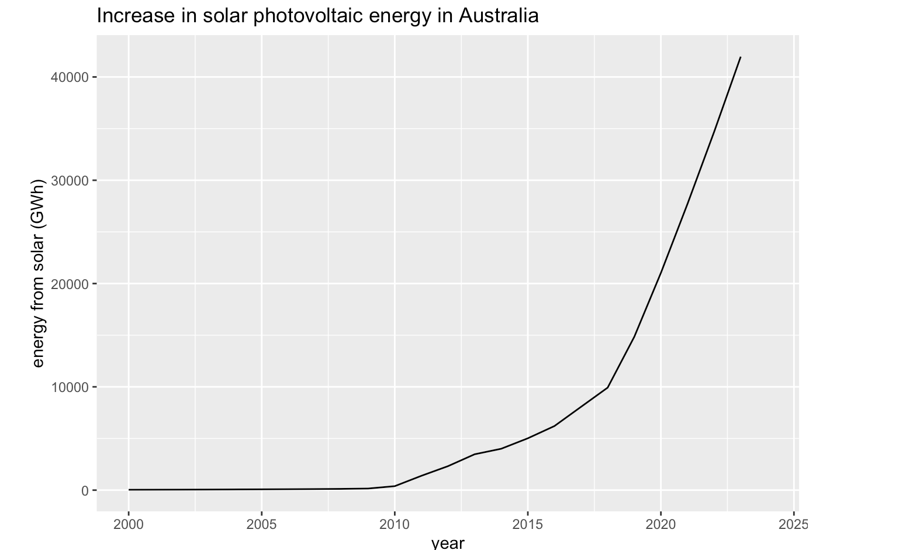

In this data story I explore the impacts of the development of solar photovoltaic energy in Australia on their CO2 emissions. This example shows how countries in the modern world can successfully transition to greener economies. <https://pattemj0.github.io/Energy/> (<https://github.com/pattemj0/Energy>)

