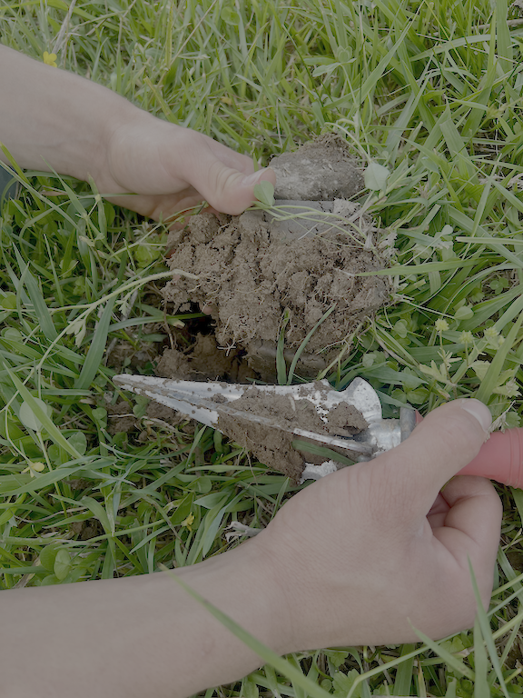

In this data story I explore the differences between soil organic carbon, soil aggregate stability, soil nutrients, and plant diversity on three farms on the Cumberland Plateau. The project aims to see the impacts of different agricultural practices on the landscape. <https://pattemj0.github.io/Comparison-of-Plateau-Farms/> (<https://github.com/pattemj0/Comparison-of-Plateau-Farms>)

