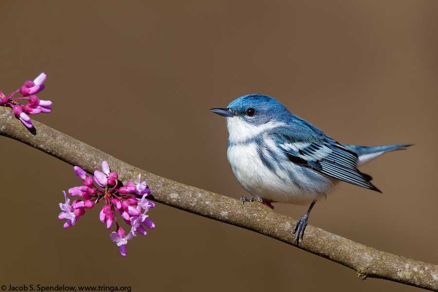

In this bookdown document I explore the status of several species of birds native to Tennessee that are in decline including the Red-headed Woodpecker, the Cerulean Warbler, The Golden-winged Warbler, and the Whip-poor-will. Each bird faces a unique set of challenges causing their decline. This page shows how issues from the other side of the world like deforestation in South America have a large effect on our own ecosystems and species we interact with daily. <https://pattemj0.github.io/Datastory3/> (<https://github.com/pattemj0/Datastory3>)

