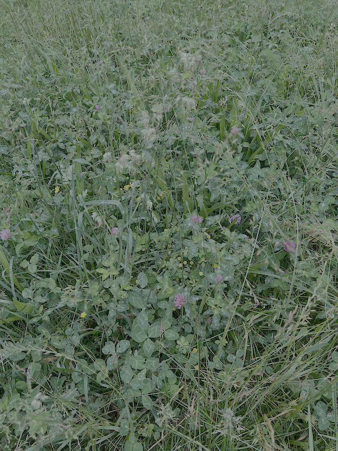

This app allows someone doing research involving plant species richness to collect data straight into an csv file where it can be processed by R. R then compares species richness between plots showing differences in species richness between different study plots. <https://github.com/pattemj0/Plant-diversity-data-collection/blob/main/README.md>

